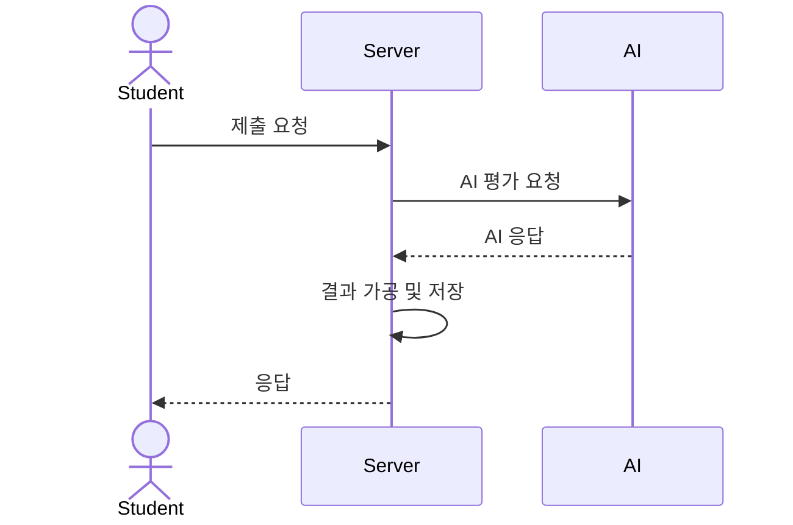
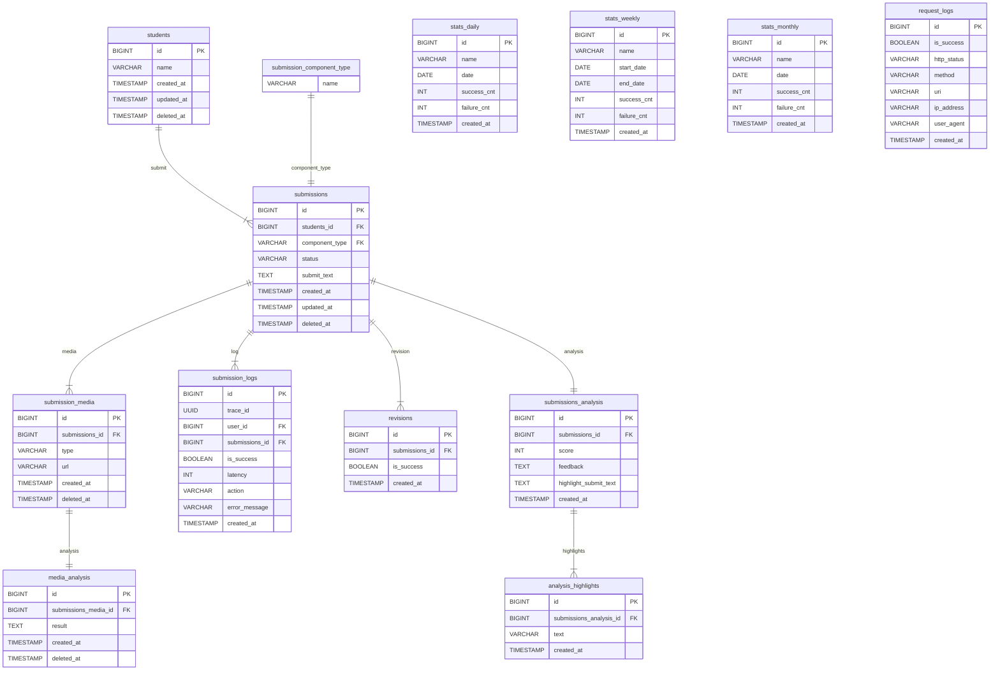

# AI Feedback Service

> 학생 제출물(에세이) AI 자동 평가 서비스
제출, 채점, 통계 집계, 재평가의 전체적인 플로우를 다루는 백엔드 시스템
> 

---

## 🛠️ 기술 스택

| 항목 | 내용 |
| --- | --- |
| Framework | NestJS (v10) |
| Language | TypeScript |
| DB | PostgreSQL |
| ORM | Prisma ORM |
| Authentication | JWT Bearer 인증 |
| API Docs | Swagger (OpenAPI 3.0) |
| Scheduler | @nestjs/schedule, node-cron 기반 |
| Containerization | Docker, Docker Compose |
| Validation | class-validator, class-transformer |
| Testing | Jest (Unit + E2E) + Supertest |

---

## 🛤️ 전체 시스템 플로우



---

## 📄 ERD (DB 구조)



**💡 주요 특징:**

- `submission_logs`: 평가/재평가 로그
- `request_logs`: 모든 HTTP 요청 로그 (middleware)
- `stats` → 일간, 주간, 월간 테이블 분리 vs 통합
    - 사용자 수가 적은 경우 하나로 관리해도 가능하나 많은 경우라고 가정해서 분리해서 적용
    - 사용자 수가 많아 데이터가 많은 경우, 배치가 같은 시간대에 병렬로 동작, 추후 일간 데이터 파티셔닝을 고려해 테이블 분리로 결정
- `media`: type으로 구분 -> 추후 분석 확장을 위해
- `media_analysis` 테이블은 현재 사용X
- `submission_logs` → 비즈니스 도메인 로그. 평가, 재평가 호출시 트레이싱
    - request log에서 submission log를 1대 다를 통해 트레이싱하려 했으나, 구현상 request log가 미들웨어에서 적재되어 지금 설계에선 불가
- `request_logs` → api 공통 로그

---

## 🧪 예외 처리 (Global Policy)

- 모든 예외 -> **HTTP 200** + `{ result: "failed", message: "사유" }`
- 서버 오류, Validation Error 모두 단일 형태
- (TODO) 에러 발생시 알림 추가 구현 필요

---

## 🧐 테스트 방법

### Test

```bash
# script 폴더에서 실행후
$ ./dev-db-init.sh

npm run test
```

---

## 💪 로컬 환경

```bash
# Docker-Compose 실행
docker-compose up -d --build

# Docker-Compose 실행
docker-compose down
```

### Swagger 접속

> http://localhost:3000/api
> 

---

## 📅 참고

- RequestLogging Middleware에서 requestLog DB 기록
- AutoRetryScheduler로 평가 실패 재시도
- Submission Status(PENDING/PROCESSING/COMPLETED/FAILED) 관리 차원